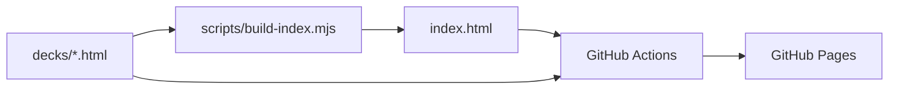

<div align="center">

# OpenDecks

**A tiny, zero-dependency home for your slide decks.**
Drop a self-contained HTML file in a folder, push, and it's live on GitHub Pages with an auto-generated index.

[](https://github.com/saumon/opendecks/actions/workflows/pages.yml)
[](https://saumon.github.io/opendecks/)
[](https://nodejs.org/)
[](scripts/build-index.mjs)
[](https://github.com/saumon/opendecks/commits)
[](#contributing)

[**Live site**](https://saumon.github.io/opendecks/) · [Add a deck](#adding-a-deck) · [How it works](#how-it-works) · [FAQ](#faq)

</div>

---

## Table of contents

- [Why](#why)
- [Decks](#decks)
- [How it works](#how-it-works)
- [Project structure](#project-structure)
- [Adding a deck](#adding-a-deck)
- [Deck requirements](#deck-requirements)
- [Local preview](#local-preview)
- [Deployment](#deployment)
- [FAQ](#faq)
- [Contributing](#contributing)

## Why

Slides are usually trapped in proprietary formats and tools. OpenDecks takes the opposite approach:

- **Plain HTML.** Each deck is one static, self-contained `.html` file. It opens anywhere, diffs in git, and will still work in ten years.
- **No build pipeline for decks.** Whatever tool produced your deck, if the output is a single HTML file, it fits.
- **No framework, no dependencies.** The only code is a ~70-line Node script that builds the landing page.
- **Free hosting.** GitHub Pages serves everything.

## Decks

| Deck | Topic |
| --- | --- |
| [lean tech — the manifesto](https://saumon.github.io/opendecks/decks/lean-tech.html) | Book club notes on *The Lean Tech Manifesto*: why Agile doesn't scale and what Lean brings (customer value, team networks, right-first-time, just-in-time, learning organization). In French. |
| [tmux — the comeback](https://saumon.github.io/opendecks/decks/tmux-the-comeback.html) | Why tmux matters again for remote, agent-driven development. |
| [vi, vim, neovim — and vis](https://saumon.github.io/opendecks/decks/vi-vim-neovim.html) | From ed to Neovim: the history of modal editing, how vi, Vim and Neovim differ, and vis as a modern alternative. |

The [live site](https://saumon.github.io/opendecks/) always lists the current decks.

## How it works

GitHub Pages serves static files but **cannot list a directory** at runtime. So the index is generated at deploy time instead:



1. On every push to `dev`, the [workflow](.github/workflows/pages.yml) runs `scripts/build-index.mjs`.
2. The script scans `decks/`, reads each deck's `<title>` (and optional `<meta name="description">`), looks up the last git commit date, and writes `index.html`.
3. The workflow publishes `index.html` and `decks/` to GitHub Pages.

Because the index is rebuilt on each deploy, it can never drift out of sync with the decks.

## Project structure

```text
.
├── decks/                  # one self-contained .html file per deck
│   ├── lean-tech.html
│   ├── tmux-the-comeback.html
│   └── vi-vim-neovim.html
├── scripts/
│   └── build-index.mjs     # generates index.html (Node, no dependencies)
├── .github/workflows/
│   └── pages.yml           # build + deploy to GitHub Pages
├── index.html              # generated entry point (do not edit by hand)
├── favicon.svg             # site icon
└── .nojekyll               # tells Pages to serve files as-is
```

## Adding a deck

1. Put your deck in `decks/`, using a URL-friendly name (lowercase, hyphens, no spaces): `decks/my-talk.html`.
2. Make sure it has a meaningful `<title>`. It becomes the card title on the home page.
3. *(Optional)* Add a subtitle shown on the card:
   ```html
   <meta name="description" content="One-line summary of the talk">
   ```
4. Commit and push to `dev`. The site updates in about a minute.

## Deck requirements

| Requirement | Why |
| --- | --- |
| Single `.html` file | The index links directly to the file; relative assets are not copied or checked. |
| Inline CSS, JS and images (e.g. `data:` URIs) | Keeps each deck portable and independent. |
| A `<title>` | Used as the display name; falls back to the file name. |
| File name without spaces or accents | Gives clean, shareable URLs. |

> [!NOTE]
> Only top-level `.html` files in `decks/` are listed. Subfolders are not scanned.

## Local preview

Requires Node.js 18+ (no `npm install` needed).

```bash
node scripts/build-index.mjs      # regenerate index.html
python3 -m http.server 8000       # or any static file server
# open http://localhost:8000
```

## Deployment

One-time setup in your repository:

1. Go to **Settings → Pages**.
2. Under **Build and deployment → Source**, select **GitHub Actions**.
3. Make sure `dev` is allowed to deploy: the `github-pages` environment only accepts the default branch by default, so either make `dev` the repository's default branch, or add it under **Settings → Environments → github-pages → Deployment branches**.
4. Push to `dev` (or run the workflow manually from the **Actions** tab).

The site is then available at `https://<owner>.github.io/<repo>/`.

## FAQ

**Can the index be generated in the browser instead?**
Not reliably. Pages has no directory listing, and the GitHub API is rate-limited and tied to a specific repository. Generating at deploy time is simpler and more robust.

**Do I need to commit the generated `index.html`?**
It's committed so the repo works locally out of the box, but CI regenerates it on every deploy, so the deployed version is always current.

**Can I use a custom domain?**
Yes: add a `CNAME` file and configure it under **Settings → Pages**. Make sure the workflow copies it into the published `_site/` folder.

**Does it work with any slide tool?**
Anything that exports a standalone HTML file works (reveal.js single-file exports, hand-written HTML, AI-generated decks, etc.).

## Contributing

Contributions are welcome. Open an issue to discuss a change, or send a pull request. Keep the project's spirit: small, static, dependency-free.

---

<div align="center">
<sub>Built with plain HTML, one Node script, and GitHub Pages.</sub>
</div>
